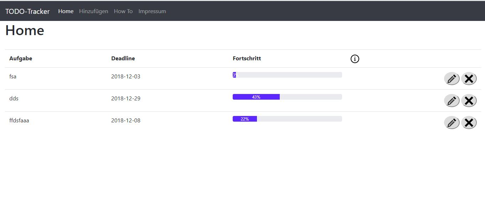

#GO TODO Webanwendung

##HOW TO RUN?

### Windows
1. run app.exe to start the GO-Server
2. go to http://localhost:8080 on your Web Browser

###Linux / Mac
1. run app via Terminal `./app` to start the Server
2. go to http://localhost:8080 on your Web Browser
